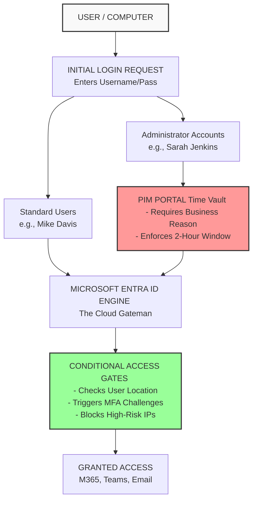

# Enterprise Cloud Hardening: Implementing a Zero Trust Framework in Microsoft 365

## Introduction
In the modern corporate world, the traditional way of protecting a network—building a strong perimeter wall around an office—no longer works. Employees work from anywhere, using cloud applications and mobile devices. If a cybercriminal steals a single employee password or compromises a laptop, they can bypass traditional defenses entirely and gain access to sensitive corporate data.

To solve this problem, I built an end-to-end security framework inside a live corporate cloud environment using the **Zero Trust** strategy: *"Never Trust, Always Verify."* Instead of assuming a user is safe just because they typed a correct password, this system acts like a strict security guard at every single step. It constantly checks who the user is, where they are connecting from, and whether their computer is secure before letting them look at a single file. 

This project demonstrates how to stop identity theft, block administrative account takeovers, track physical company laptops, and hunt down active hackers inside the network.

---

## Architectural Blueprint
Below is the system logic map detailing how security requests flow and how defenses block or allow access across the environment:

### Live System Architecture Roadmap

---

## Key Skills Demonstrated
*   **Identity Governance:** Setting up clean user directories, permissions, and security boundaries.
*   **Cloud Security Architecture:** Building automated rules to block untrusted login locations and force identity verifications.
*   **Privileged Identity Management (PIM):** Eliminating dangerous 24/7 permanent admin accounts by locking power behind a time-vault.
*   **Endpoint Detection & Telemetry:** Connecting physical laptops to the cloud and installing deep-level logging tools to watch system behavior.
*   **Forensic Analysis & Threat Hunting:** Searching through backend system logs to find, track, and prove malicious behavior.

---

## Phase 1: Identity Access Security & Cloud Perimeters

### 1. Initialized the Corporate Infrastructure Command Center
I set up our main corporate cloud network container (`Cyberdome80`) and activated a **Microsoft Entra ID P2 Premium** foundation. This premium level provides the core engineering brain needed to build automated, smart security rules.

### 2. Built Directory Segmentation Boundaries
I built specific digital containers (groups) to keep staff members organized and prevent standard employees from accidentally getting powerful administrative permissions:
*   **`SG-All-Staff`:** Holds standard company employee profiles. 
*   **`SG-Untrusted-Regions`:** Keeps track of profiles operating in areas requiring extra oversight.

### 3. Defined the Geographic Fencing Perimeter
I created a custom network blocklist called **`High-Risk-Regions`**. This tells our digital gatekeepers exactly which international locations and untrusted IP networks are known sources of cyberattacks, allowing the system to flag them instantly.

### 4. Configured Automated Gate Enforcement
I deployed two distinct, live automated gate rules to handle risks on the fly:
*   **`CA-Block-High-Risk-Regions`:** Instantly cuts off and drops any connection attempt coming from our geographic blocklist.
*   **`CA-Enforce-Staff-MFA`:** Intercepts standard employees when they connect from outside the main office and forces them to verify their identity on their phone before moving forward.

### 5. Verified Live Production Sign-In Logs
I tested the system using a mock employee account, **Mike Davis**. The moment Mike typed his password, the system caught the request, recognized he was outside the main office, and forced an MFA confirmation code to his phone. 

Once he cleared the check, the backend logged a **Success** stamp, safely authorizing his cloud identity and granting him access to his dashboard apps.

---

## Phase 2: Administrative Privilege Abuse Mitigation (PIM)

### 1. Eradicated Permanent 24/7 Admin Exposure
If a hacker steals the password to a permanent administrator account, they gain total control over the entire company forever. To eliminate this risk, I stripped away all permanent admin rights and implemented a **Just-In-Time (JIT)** security vault using **Privileged Identity Management (PIM)**.

### 2. Configured the Secure Admin Vault
I created an administrative account for an IT employee, **Sarah Jenkins**. Sarah has zero power by default. When she needs to do maintenance, she must log into the PIM vault, request her keys, type out an explicit business reason for the request, and submit it. The system automatically locks her access to a strict **2-hour maximum limit**.

### 3. Logged the Live Compliance Auditing Stamps
I audited the system logs right after Sarah requested her keys. The live dashboard shows our security boundaries working exactly as planned: her power turned on at **1:07 AM** and was explicitly scheduled to expire at **3:07 AM**. Once that countdown hits zero, the cloud strips her admin privileges away automatically, leaving no standing power for a hacker to abuse.

---

## Phase 3: Endpoint Integrity, Attack Simulation & Forensic Hunting

### 1. Established Hardware Trust Baselines
A secure identity needs a secure device. I linked my local Windows 10 Pro test computer to our corporate cloud domain using the **Microsoft Entra Join** wizard. This registers the physical laptop as an official corporate asset and binds it directly to our test user, **Mike Davis**, ensuring unverified personal devices cannot easily access corporate files.

### 2. Deployed Kernel Monitoring Telemetry
To see deep inside the operating system, I deployed System Monitor (**Sysmon**). This monitoring tool sits inside the root engine of the laptop, continuously tracking hidden system behaviors and process starts so blue-team security analysts have total visibility during an investigation.

### 3. Attack Simulation #1: Hostile Token & Cookie Extraction
To test our defenses, I ran a simulated cyberattack. Using an administrative console, I simulated an advanced token-theft threat targeting browser data and login cookies (`tokenbrokercookies.exe`). This mimics a real-world scenario where an attacker tries to steal active web sessions off a laptop to hijack the user's logged-in status without needing their password or MFA.

### 4. Forensic Investigation & Threat Hunting for Token Theft
Acting as a blue-team defender, I investigated the laptop's telemetry logs to find the attack trail. The log search safely caught the exact moment the malicious extraction tool ran, detailing the entire process history so response teams can immediately isolate the threat.

### 5. Attack Simulation #2 & Real-Time Hunt: File Discovery
To show a different type of threat, I ran a secondary attack simulation. In the black Command Prompt window, I ran a rapid file search command (`where.exe /r`) to mimic an attacker hunting through folder structures for sensitive company data. 

Behind that window, you can see our Event Viewer tracking the hunt in real time. Sysmon caught the action under **Event ID 1 (Process Create)**, perfectly linking the unauthorized search back to the attacker's context and matching it against standard MITRE ATT&CK enumeration techniques.

---

## Conclusion
By shifting this corporate infrastructure from a traditional perimeter defense to a proactive **Zero Trust Framework**, I successfully closed the most common gaps used in modern cloud data breaches. 

### Key Project Outcomes:
*   **Identity Theft Mitigation:** Forcing Conditional Access gates and location checks ensures that leaked employee passwords alone are completely useless to an attacker.
*   **Zero Standing Privilege:** Implementing PIM means administrative power only exists when actively justified and automatically expires, neutralizing administrative account compromise risks.
