# Enterprise Cloud Hardening: Implementing a Zero Trust Framework in Microsoft 365

## Project Overview
I built an end-to-end "Zero Trust" security framework within a live production environment to protect corporate data from identity theft, administrative privilege abuse, and endpoint compromise. 

Modern cyber threats frequently bypass old-school network perimeters using stolen passwords or compromised devices. To address this risk, this project follows the core architecture rule of **"Never Trust, Always Verify."** I designed, deployed, and validated real-time security gates that actively inspect authentication context (user identity, geographic location, and device trust) before allowing entrance to critical infrastructure.

---

## Architectural Blueprint
Below is the system logic map detailing the authentication streams and defensive perimeters implemented across the environment:

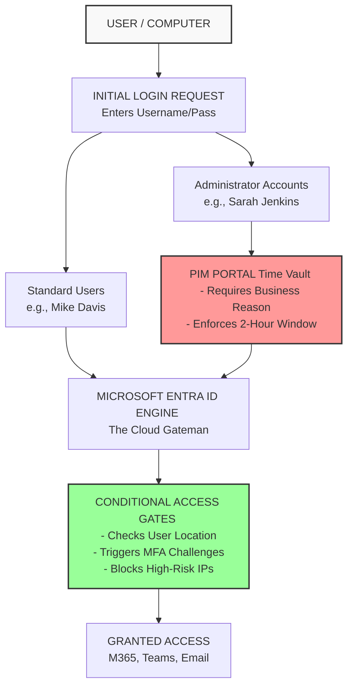

### Live System Architecture Roadmap
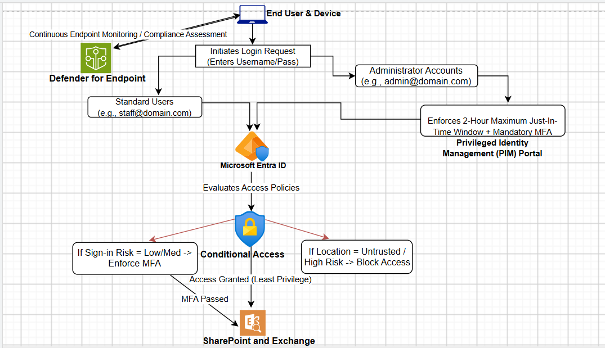

---

## Key Skills Demonstrated
*   **Identity Governance:** Directory provisioning, structural group containment, and least-privilege administrative boundary management.
*   **Cloud Security Architecture:** Conditional Access Policy engineering, geographical fencing (Named Locations), and global tenant hardening.
*   **Privileged Identity Management (PIM):** Eliminating 24/7 permanent administrative exposure via Just-In-Time role requests.
*   **Endpoint Detection & Telemetry:** Establishing hardware trust baselines via domain registration and collecting kernel-level log events.
*   **Forensic Analysis & Threat Hunting:** Investigating system process telemetry to track down and isolate sophisticated attack vectors.

---

## Phase 1: Identity Access Security & Cloud Perimeters

### 1. Initialized the Corporate Infrastructure Command Center
I initialized a custom corporate tenant network container (`Cyberdome80`) and activated a **Microsoft Entra ID P2 Premium** licensing framework. This premium baseline unlocks the underlying advanced rule processing required to enforce customized conditional routing policies.

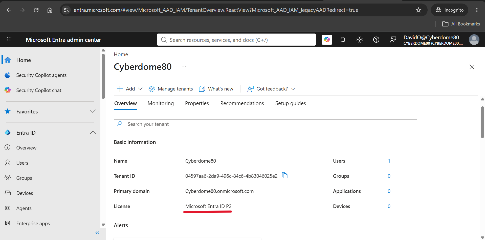

### 2. Built Directory Segmentation Boundaries
I established explicit user containers to partition structural permissions cleanly before targeting them with automated rules:
*   **`SG-All-Staff`:** Holds standard personnel profiles. 
*   **`SG-Untrusted-Regions`:** Isolate profiles operating within high-risk geographic regions.
*   *Note: Administrative roles are explicitly set to "No" across these groups to block potential permission-leaking vulnerabilities.*

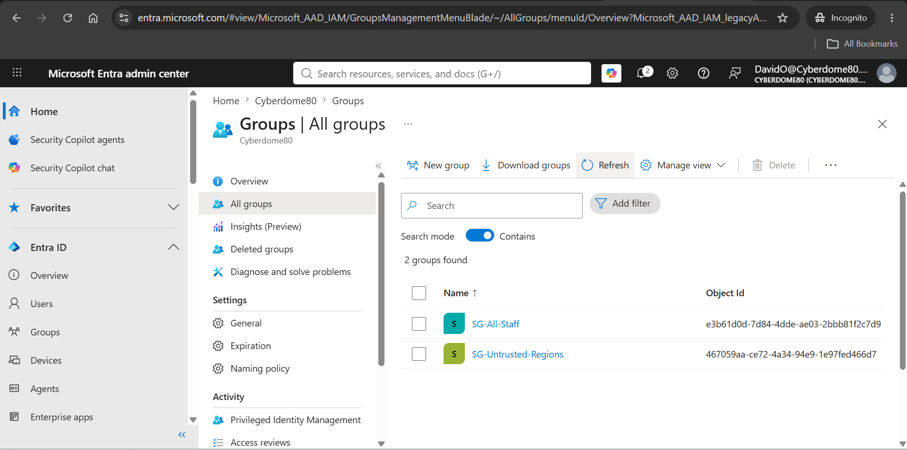

### 3. Defined the Geographic Fencing Perimeter
I compiled a custom network blocklist policy (**`High-Risk-Regions`**) within our identity console. This target-locks specific high-risk international IP blocks, allowing our gatekeepers to recognize threat origins instantly.

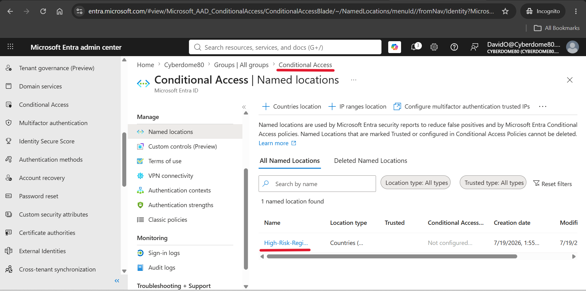

### 4. Configured Automated Gate Enforcement
I deployed two distinct live Conditional Access rules to evaluate access risk dynamically:
*   **`CA-Block-High-Risk-Regions`:** Instantly cuts off and blocks any connection hitting our boundary from our geographic blacklist.
*   **`CA-Enforce-Staff-MFA`:** Intercepts standard users and forces an immediate Multi-Factor Authentication prompt to their phone whenever they connect outside the office.

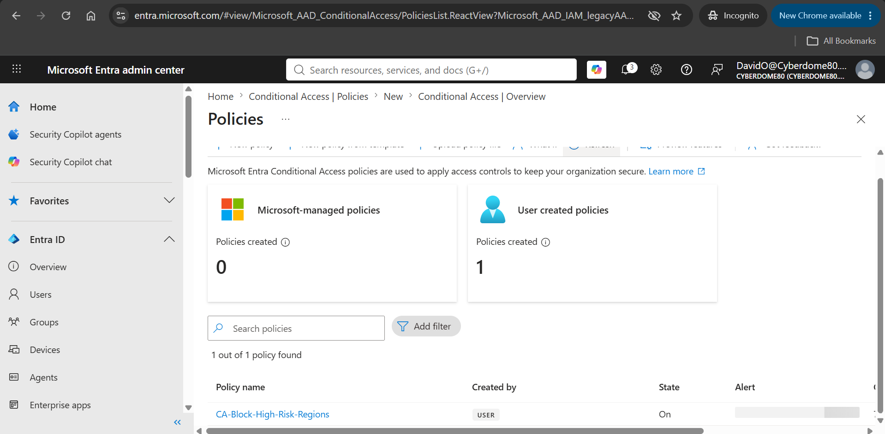
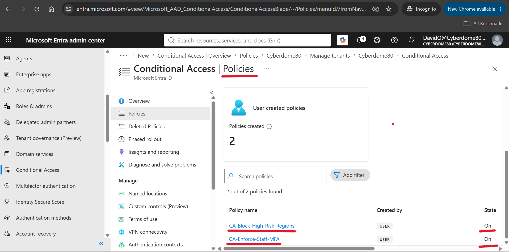

### 5. Verified Live Production Sign-In Logs
I conducted a live verification audit by signing in as a test employee, **Mike Davis**. The second he typed his username and password, the system instantly intercepted the login and requested an MFA verification check on his phone, exactly as I designed it to do. 

Once the phone check was cleared, the system recorded a definitive **Success** flag in the Microsoft Entra Sign-In Logs. The engine securely verified his identity when he accessed his account dashboard (**My Profile**) and safely granted him access to the backend cloud data network (**Microsoft Graph**).

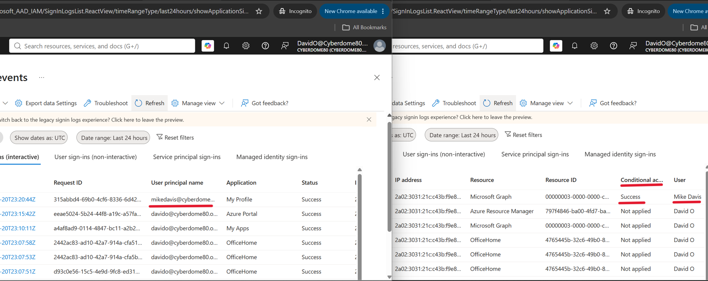

---

## Phase 2: Administrative Privilege Abuse Mitigation (PIM)

### 1. Eradicated Permanent 24/7 Admin Exposure
To prevent a catastrophic full-scale network takeover if administrative keys are ever leaked, I removed permanent global admin permissions. I implemented a **Just-In-Time (JIT) elevation model** via **Privileged Identity Management (PIM)**.

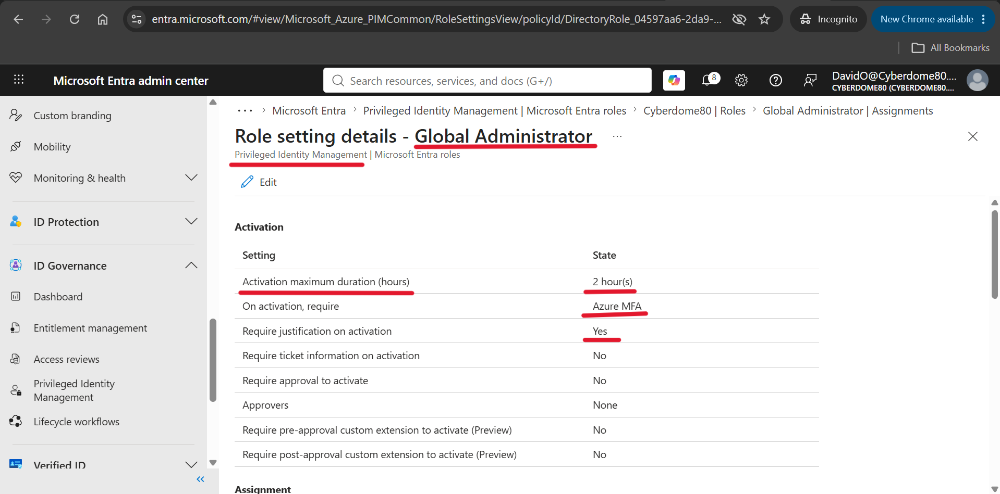

### 2. Configured the Secure Admin Vault
I created a dedicated account for a new employee, **Sarah Jenkins**, to serve as a high-privileged administrator in our system. Instead of giving her permanent power, I assigned her as *eligible* inside our time-vault. I then logged in as Sarah to run a live production audit and request her Global Administrator keys. 

The screen popped forward, forced her to type an explicit business explanation into the justification box, and automatically locked her maximum power window to a strict **2-hour ceiling**.

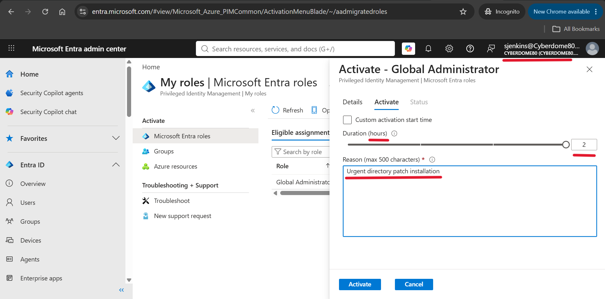

### 3. Logged the Live Compliance Auditing Stamps
I verified the directory state immediately after Sarah submitted her business reason to pull the keys out of the time vault. The dashboard records that Sarah's account was successfully granted temporary administrative access. 

The screenshot captures our live security boundaries in action: her access window explicitly starts at **1:07 AM** and is automatically set to terminate at **3:07 AM**. Once the 2-hour timer runs out, the cloud system strips her admin privileges away automatically.

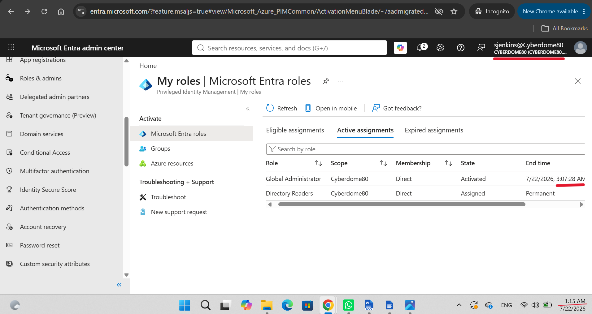

---

## Phase 3: Endpoint Integrity, Attack Simulation & Forensic Hunting

### 1. Established Hardware Trust Baselines
I physically linked my local Windows 10 Pro computer to our online cloud network using the built-in Windows registration wizard. This process is called a **Microsoft Entra Join**. This step officially registers the physical laptop as a verified company asset and securely binds the computer to our standard test user account, **Mike Davis**.

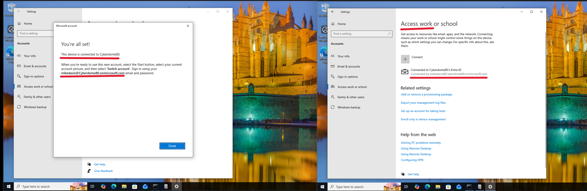

### 2. Deployed Kernel Monitoring Telemetry
I deployed advanced monitoring architecture to achieve deeper endpoint visibility. I installed System Monitor (**Sysmon**) into the operating system's root subsystem to continuously track internal events and log crucial kernel-level activities.

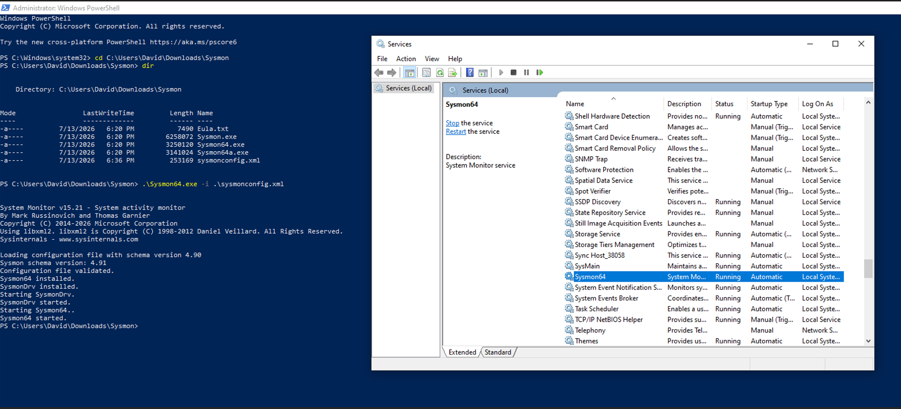

### 3. Attack Simulation #1: Hostile Token & Cookie Extraction
With structural guardrails in place, I executed a controlled hostile simulation targeting active identities. Operating out of an administrative PowerShell console, I simulated an advanced credential access threat targeting primary refresh tokens (PRTs) and browser data cookies (`tokenbrokercookies.exe`). This mimics an adversary attempting to bypass cloud identity boundaries by hijacking active session states directly from a compromised corporate endpoint.

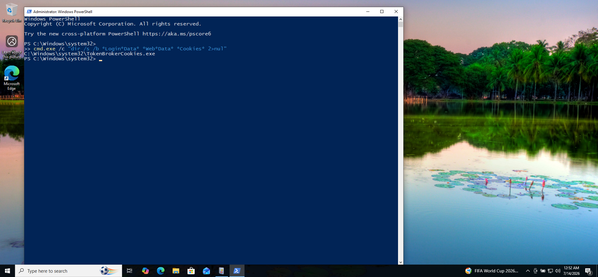

### 4. Forensic Investigation & Threat Hunting for Token Theft
To evaluate our blue-team defense capabilities, I combed through the internal Event Viewer telemetry to isolate the token-theft exploit footprint. The deep system parsing engine successfully flagged and tracked the execution lifecycle, verifying full analytical traceability for threat response teams.

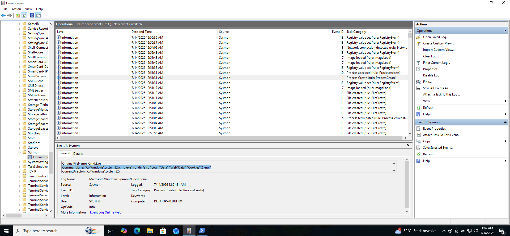

### 5. Attack Simulation #2 & Real-Time Hunt: MITRE T1083 Discovery
To demonstrate a comprehensive attack lifecycle, I executed a secondary discovery simulation. In the black Command Prompt window, I ran an advanced process search command (`where.exe /r`) targeting the local file structure to mimic an adversary enumerating critical local files. 

Concurrently, I validated the real-time vigilance of our monitoring system. As documented below, Sysmon immediately flagged the activity under Event ID 1 (Process Create), cleanly mapping the execution string back to the user context and explicitly matching it against MITRE ATT&CK Technique T1083 (File and Directory Discovery).

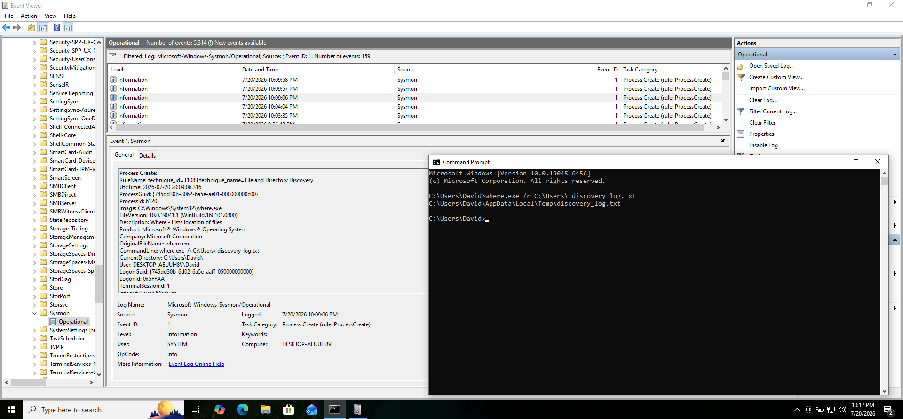
